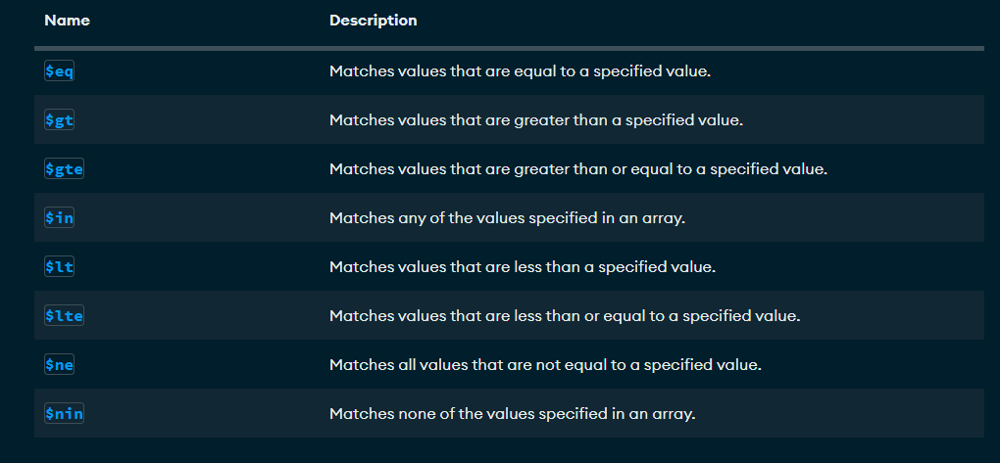
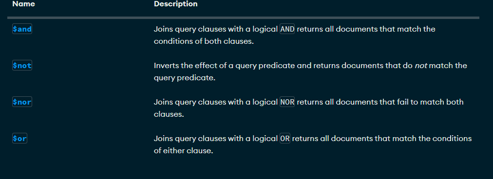

# Crud y consultas en MongoDB
Solo se crea si contiene por lo menos una coleccion
**use bd1**

## Como crear una coleccion
use db1
db.createCollection("Empleado")

## Mostrar las colecciones
show collections

## Insertar un documento


```json
 db.Alumnos.insertOne(
  {
    _id: ObjectId('679d2ab6078c2dd4adcb0ce2'),
    nombre: 'Soyla',
    apellido1: 'Vaca',
    ciudad: 'San Miguel de las Piedras'
  }
)
```

## Insercion
```json
db.Alumnos.insertOne
(
 { 
    nombre: "Joaquin",
    apellido1: "Dorian",
    apellido2: "Guerrero",
    edad: 15,
    aficiones: ["Cerveza","Hueva","Canavis"]
 }
)
```
## Insercion de documentos mas complejos con documentos anidados 
```json
db.Alumnos.insertOne
(
 {
    nombre: "Leonardo",
    apellido1: "Barrera",
    apellido2: "Tejeda",
    edad: 20,
    estudios: [
            "Kinder","Primaria","Secundaria","Preparatoria"
              ],
    experiencia: {
    lenguaje: "SQL",
    sbd: "SQL Server",
    aniosExp: 14
        }
 }
)
```

# Practica 1

## Cargar datos
[Libros.json](./data/libros.json)

## Busquedas. Condiciones simples de igualdad. Metodo find()

1. Seleccionar todos los documentos de la coleccion libros

```json
 db.libros.find({})
```

2. Mostrar todos los documentos que sean de la editorial biblio

```json
db.libros.find({editorial: 'Biblio'})
```

3. Mostrar todos los documentos que el precio sea 25

```json
db.libros.find({precio: 25})
```
4. Seleccionar todos los documentos donde el titulo sea Json para todos

```json
db.libros.find({titulo: 'JSON para todos'})
```

## Operadores de comparacion

[Operadores de comparacion](https://www.mongodb.com/docs/manual/reference/operator/query/)



1. Mostrar todos los documentos donde el precio sea mayor a 25

```json
db.libros.find({precio:{$gt: 25}})
```

2. Mostrar los documentos donde el precio sea 25

```json
db.libros.find(
 {
   precio:{$eq: 25}
 }
)
```

3. Mostrar los documentos cuya cantidad sea menor a 5

```json
db.libros.find(
  {
    precio:{$lt: 5}
  }
)
```

4. Mostrar los documentos que pertenezcan a la editorial biblio o planeta

```json
db.libros.find(
  {
    editorial:{$in: ['Biblio', 'Planeta']}
  }
)
```

5. Mostrar todos los documentos de libross que cuestes 20 o 25

```json
db.libros.find(
  {
    precio:{$in:[20, 25]}
  }
)
```

6. Mostrar todos los documentos de libros que no cuesten 20 o 25

```json
db.libros.find(
  {
    precio:{$nin:[20, 25]}
  }
)
```
7. Mostrar el primer documento de libros que cueste 20 o 25

```json
db.libros.findOne(
  {
    precio:{$in:[20, 25]}
  }
)
```

## Operadores logicos 

[Operadores logicos](https://www.mongodb.com/docs/manual/reference/operator/query/)



### Operador AND

Dos posibles opciones de AND 

1. La simple mediante condiciones separadas por comas

***sintaxis***<br> 
db.coleccion.find({condicion1, condicion2}) -> Con esto asume que es una ***and***

2. Usando el operador $and

***sintaxis***<br>
```json
db.coleccion.find(
 {
   $and:[{condicion1},
   {condicion2}]
 }
)
```

### Ejercicios

1. Mostrar todos aquellos libros que cuesten mas de 25 y cuya cantidad sea inferior a 15

***Forma simple***

```json
db.libros.find(
 {  
   precio: { $gt: 25 },  
   cantidad: { $lt: 15 }
 } 
)
```

2. Mostrar todos aquellos libros que cuesten mas de 25 y cuya cantidad sea inferior a 15 y id igual 4

```json
db.libros.find(
 {  
      precio: { $gt: 25 },  
      cantidad: { $lt: 15 }, 
      _id: {$eq: 4} 
 } 
)
```
***Operador $and***

1. Mostrar todos aquellos libros que cuesten mas de 25 y cuya cantidad sea inferior a 15

```json
db.libros.find( 
 {
    $and: [{precio: {$gt: 25}},
    {cantidad: {$lt: 15}}]
 }
)
```

2. Mostrar todos aquellos libros que cuesten mas de 25 y cuya cantidad sea inferior a 15 y id igual 4

```json
db.libros.find( 
 {
    $and: [{precio: {$gt: 25}},
    {cantidad: {$lt: 15}},
    {_id: {$eq: 4}}]
 }
)
```

### Operador OR

1. Mostrar todos aquellos libros que cuesten mas de 25 o cuya cantidad sea inferior a 15

```Json
db.libros.find( 
 { 
   $or: 
   [ 
      {precio: {$gt: 25}}, 
      {cantidad: {$lt: 15}}
   ] 
 }
)
```

### AND y OR cobindas

1. Mostrar los libros de la editorial Biblio con precio mayor a 30 o libros de la editorial Planeta con precio mayor a 20

```Json
db.libros.find( 
 { 
  $or: 
  [ 
   { $and: [{editorial: 'Biblio'},{precio: {$gt: 30}}] }, 
   { $and: [{editorial: 'Planeta'},{precio: {$gt: 20}}]}
  ]
 }
)
```

```Json
db.libros.find( 
 {  
   $or:
  [ 
   {editorial: 'Biblio',precio: {$gt: 30} }, 
   {editorial: 'Planeta', precio: {$gt: 20}}
  ]
 }
)
```
## Proyeccion

*** Sintaxis ***
```Json

db.coleccion.find(filtro,columnas)

db.libros.find({},{titulo:1})

```
1. Seleccionar todos los documentos mostrando el titulo y la editorial

```Json
db.libros.find(
   {},
   {titulo:1,editorial:1}
)
```

2. Seleccionar todos los documnetos de la editorial Planeta mostrando solamente el titulo y la editorial

```Json
db.libros.find(
   {editorial: 'Planeta'},
   {_id:0,titulo:1,editorial:1}
)
```

## Operador exists (Permite saber si un campo se encuentra o no es un documento)

```Json
db.libros.find(
 {
  editorial:{$exists:true}
 }
)
```

```Json
db.libros.insertOne(
 {
  _id: 10,
  titulo: 'Mongo en entornos graficos',
  editorial: 'Tierra',
  precio: 125
 }
)
```

1. Mostrar todos los documentos que no contengn el campo cantidad

```Json
db.libros.find(
 {
  cantidad:{$exists:false}
 }
)
```

## Operdador type (permite preguntar si un determinado campo corresponde con un tipo)

[Operador type](https://www.mongodb.com/docs/manual/reference/operator/query/type/#mongodb-query-op.-type)

1. Mostar todos los documentos dode el precio sean dobles 

```Json
db.libros.find(
 {
    precio: {$type:1}
 }
)
```

```Json
db.libros.find(
 {
    precio: {$type:16}
 }
)
```

```Json
db.libros.insertOne(
 {
  _id: 11,
  titulo: 'IA',
  editorial: 'Terra',
  precio: 125.4,
  cantidad: 20
 }
)
```

```Json
db.libros.find( 
  { precio: { $type: 1 } },
  {_id:0, precio:1} 
)
```
1. Seleccionar los documentos donde el precio sea de tipo entero

```Json
db.libros.find(
 {
    editorial: {$type:16}
 }
)
```
```Json
db.libros.find(
 {
    editorial: {$type:'int'}
 }
)
```

2. Seleccionar todos los documentos donde la editorial sea String

```Json
db.libros.find(
 {
    editorial: {$type:2}
 }
)
```
```Json
db.libros.find(
 {
    editorial: {$type:'string'}
 }
)
```

## Practica de consultas 

1. Insertar las tools de mongodb<br>
[DatabaseTools](https://www.mongodb.com/try/download/database-tools)

2. Cargar el Json empleados (Debemos estar ubicado en la carpeta donde se encuentra el Json empleados)

- En local:<br>
comando:<br>
mongoimport --db cursos --collection empleados - file empleados, json

## Operador exists (Permite saber si un campo si un campo se encuentra o no en un documento)

json
db.libros.find( { editorial:{ $exists:true } } )


1. Mostrar todos los documentos que no contengan el campo cantidad

json
db.libros.find(
 {
   cantidad:{$exists:false}
 }
)


## Operador Type (Permite preguntar si un determinado campo corresponde con un tipo) 

[Operador Type](https://www.mongodb.com/docs/manual/reference/operator/query/type/#mongodb-query-op.-type)

1. Mostrar todos los documentos donde el precio sean dobles

```json
db.libros.find({precio:{$type:1}})
db.libros.find({precio:{$type:16}})


db.libros.insertOne({
  _id:11,
  titulo: 'IA',
  editorial: 'Terra', 
  precio:125.4,
  cantidad: 20
})


db.libros.insertMany([
 {
    _id: 12,
    titulo: 'IA',
    editorial: 'Terra',
    precio: 125, 
	cantidad: 20
  },
  {
    _id: 13,
    titulo: 'Python para todos',
    editorial: 2001,
    precio: 200, 
	cantidad: 30
  }]
  )


db.libros.find({_id:13}

db.libros.insertOne({editorial:{$type:16}})
```

1. Seleccionar todos los documentos don


## Practica de consultas
1. Instalar las tools de monofdb


2. Cargar json
--En local:
  mongoimport --db curso --collection empleados --file empleados

# Modificando Documentos
## Comandos importabtes
1. updateOne -> Modififcar un solo documento
2. updateMany -> Modificar multiples documentos 
3. replaceOne -> Sustituir el contenido completo de un documento

Tiene el segundo formato:

json
db.collection.updateOne(
  {filtro},{operador: }
)


### Operador set
1. Modificar un documento
json
db.libros.updateOne({titulo:'Python para torpes'},{$set:{titulo:'Java para todos'}})


2. Actualizar el precio a 100 y la cantidad a 50 para el _id: 10
json
db.libros.updateOne({_id:10},{$set:{precio:100, cantidad: 50}})


### Modificar Multiples Documentos

--Modificar todos los documentos donde el precio sea mayor a 100 a un precio de 150
json
db.libros.updateMany({precio:{$gt:100}},{$set:{precio:150}})


2. Operador $inc y $mul


- Actuallizar con un incremento de 5 todos  los elementos
 ```json
db.libros.updateMany(
  {},
  {$inc: {precio:5}}
)
```

- Actualizar con multiplicacion todos los elementos que sean mayores de 20

```json
db.libros.updateMany({cantidad:{$gt:20}},{$mul:{cantidad:2}})
```

- Actualizar todos los documentos donde el precio sea mayor a 20
y se multipiquen por 2 la cantidad y el precio

```json
db.libros.updateMany(
  {precio:{$gt:20}},
  {$mul:{cantidad:2,precio:2}}
)
```
3. Reemplazar documentos (remplaceOne)

```json
db.libros.replaceOne(
  {_id:2},
  {titulo:'De la tierra a la luna',autor:'Julio Verne',precio:500}
)
```
# Borrar documenntos

1. deleteOne -> Elimina un documento
1. deleteMany -> Elimina multiples documentos

1. Eliminar el documento con id 2

```json
db.libros.deleteOne(_id:2)
```

2. Eliminar los documentos donde el cantidad sea mayor o igual a 100

```json
db.libros.deleteOne(
  {
    cantidad:{$gte:100}
  }
)
```

# Exprensiones regulares 

1. Buscar los libros que contengan las letra t

```json
db.libros.find(
  {titulo:/t/}
)
```

2. Buscar los libros que en el titulo contengan la palabra JSON

```json
db.libros.find(
  {titulo:/JSON/}
)
```

3. Buscar todos los documentos que en el titulo terminen en tos 

```json
db.libros.find(
  {titulo:/tos$/}
)
```

4. Todos los documentos que en el titulo comiencen con J


```json
db.libros.find(
  {titulo:/^J/}
)
```

# Operador $regex 

[Operador Reegex](https://www.mongodb.com/docs/manual/reference/operator/query/regex/)

- Seleccionar los libros que contengan la palabra para 

```json
db.libros.find(
  {
    titulo:{$regex:'para'}
  }
)

db.libros.find(
  {
    titulo:{$regex:'JSON'}
  }
)

db.libros.find(
  {
    titulo:{$regex:/JSON/}
  }
)
```

Distinguir entre mayusculas y minusculas

```JSON
db.libros.find(
  {
    titulo:{$regex:/JSON/} ->No distingue entre mayusculas y minusculas
  }
)
```

```JSON
db.libros.find(
  {
    titulo:{$regex:/json/,$options:'i'}
  }
)
```

- Seleccionar todos los documentos que comiensen con J

```JSON
db.libros.find(
  {
    titulo:{$regex:/^j/,$options:'i'}
  }
)
```

- Seleccionar todos los libros que terminen con es

```JSON
db.libros.find(
  {
    titulo:{$regex:/es$/,$options:'i'}
  }
)
```

# Metodo sort (Ordenar documentos)

1. Ordenar los libros de manera ascendente por el precio

```JSON
db.libros.find(
  {},
  {titulo:1,precio:1,_id:0}).sort({precio:1}
)
```
2. Ordenar todos los libros de manera descendente por el precio

```JSON
db.libros.find(
  {},
  {titulo:1,precio:1,_id:0}).sort({precio:-1}
)
```
3. Ordenar los libros de manera ascendente por la editorial y de manera descendente por el precio, mostrando el titulo el precio y la editorial

```JSON
db.libros.find(
  {},
  {titulo:1,precio:1,editorial:1,_id:0}).sort({precio:-1,editorial:1}
)
```

```JSON
db.libros.find(
  {},
  {titulo:1,precio:1,editorial:1,_id:0}).sort({editorial:1,precio:-1}
)
```

# Otros metodos skip, limit, size

```JSON
db.libros.find(
  {},
  {titulo:1,precio:1,_id:0,editorial:1}.size()
)
```
```JSON
db.libros.find(
  {},
  {titulo:{$regex:/java/i}}).size()
```

- Buscar todos los libros pero mostrando los dos primeros

```JSON
db.libros.find(
  {},
  {titulo:1,precio:1,_id:0,editorial:1}).limit(2)
```

- Mostrar los tres ultimos libros

```JSON
db.libros.find(
  {},
  {titulo:1,precio:1,_id:0,editorial:1}).sort({precio:-1}).limit(3)
```

- Seleccionar todos los libros ordenados por titulo de forma desscendete saltando los dos primeros del resultado y muestre el tamaño

```JSON
db.libros.find(
  {},
  {})
  .sort({titulo:-1}).skip(2).size(2)
```

# Borrar colecciones o bases de datos

```JSON
use db5

db.createCollection('Ejemplo')

show collections

db.Ejemplo.insertOne(
  {
    nombre: 'Chapuin',
  }
)

db.Ejemplo.drop()

db.dropDatabase()
```
mongosh "mongodb+srv://cluster0.vz1ai.mongodb.net/" --apiVersion 1 --username administrador


# Practica 3. Updates y deletes

1. Cambiar el salario el empleado Imogene Nolan. Se le asigna 8000
```JSON
 db.empleados.updateOne({nombre:"Imogene"},{$set:{salario:8000}})
 ```
2. Cambiar "Belgium" por "Belgica" en los empleados (debe haber dos)
```JSON
db.empleados.updateMany({pais:"Belgium"},{$set:{pais:"Belgica"}}) 
 ```
3. Aumentar el salario de los empleados de google en 1000
```JSON
db.empleados.updateMany({empresa:"Google"},{$inc:{salario:1000}})
```
4. Reemplazar el empleado Omar Gentry por el siguiente documento
```json
{
nombre: "Omar",
apellidos: "Gentry",
correo: "sin correo",
direccion: "Sin calle",
region: "Sin region",
pais: "Sin pais",
empresa: "Sin empresa",
ventas: 0,
salario: 0,
departamentos: "Este empleado ha sido anulado"
}
```

```json
db.empleados.replaceOne(
  {_id:ObjectId('67c0a83be81cf776f6154576')},
  {
nombre: 'Omar',
apellidos: 'Gentry',
correo: 'sin correo',
direccion: 'Sin calle',
region: 'Sin region',
pais: 'Sin pais',
empresa: 'Sin empresa',
ventas: 0,
salario: 0,
departamentos: 'Este empleado ha sido anulado'
}
)
```
5. Con find comprobar que el empleado a sido Modificando
```Json
 db.empleados.find({nombre:"Omar"})
 ```
6. Borrar los empleados que ganen mas de 8500, Nota deben ser borrados 3 documentos
```Json
db.empleados.deleteMany({salario:{$gt:8500}})
 ```
7. Visualizar con una expresion regular todos los empleados con apellidos que comiencen con "R"
```Json
 db.empleados.find({apellidos:{$regex:/^R/}})
 ```
8. Buscar todas las regiones que contengan un "V" Hacerlo con el operador $regex y que no distinga mayusculas y minusculas. Deben alir 2
```Json
 db.empleados.find({regiones:{$regex:/V/i}})
 ```
9. Visualizar los apellidos de los empleados ordenados por el propio apellido
```Json
db.empleados.find({region:{$regex:/V/i}})
```
10. Indicar el numero de empleados que trabajan en google
```Json
db.empleados.find({empresa:'Google'}).size()
```
11. Borrar la coleccion empleados y la base de datos
```JSON
db.empleados.drop()

show collections

db.dropDatabase()

show dbs
```